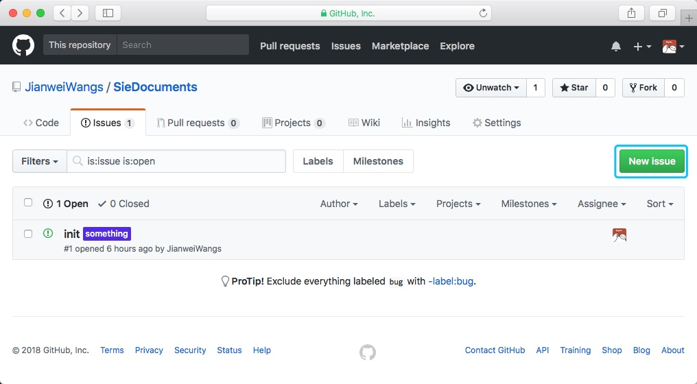
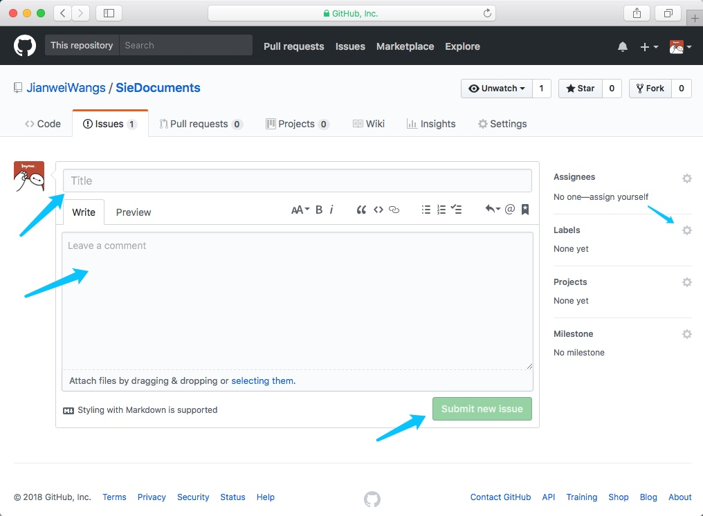
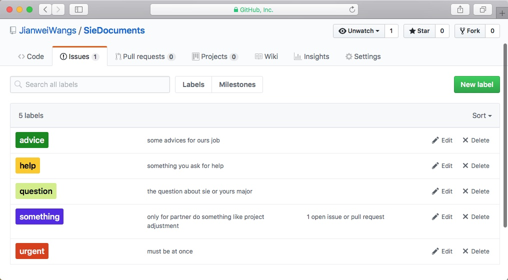

# 为什么要有提问

首先欢迎对[沈阳工程学院](http://www.sie.edu.cn)感兴趣的同学，在这里，我们会共同维护一份[文档](../../README.md)，方便新生查阅，对于这份文档的内容我们打算创建一份骨架，而内容要如何丰富就要依赖大家的求知欲了。通过大家的提问，我们会逐步完善这份文档。

# 如何提问

首先，点击[链接](https://github.com/JianweiWangs/SieDocuments/issues)，你会看到如下界面：

点击 **New issue**，重点关注图片中的箭头：

1. 填写 Title
2. 填写内容，内容支持 Markdown 语法，感兴趣的小朋友可以搜索下，这篇文档就是使用 Markdown 构建出来的
3. 注意右侧 Labels 的小齿轮，进行相关问题优先级的设置
4. 点击 Submit new issue 进行提交

## 关于 Labels 优先级

我们设定了五个优先级，我们会依照问题的优先级进行排序，依次为 urgent，help，question，advice
* question 提出的 issue 主要是对工程学院的问题
* help 需要文档维护人员的帮助
* urgent **谨慎使用**，紧急求助，有非常严重的情况
* advice 对文档维护人员的建议
* something 同学不要使用，仅针对文档维护人员的

